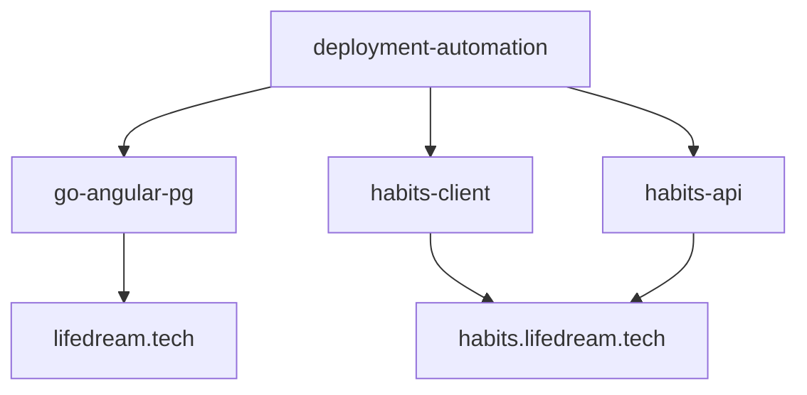

## 🚀 My Projects [[RU]](https://github.com/andreyDanilenko/andreyDanilenko/edit/main/README.ru.md)

---

### 🌐 [https://lifedream.tech](https://lifedream.tech) — main site
Articles and a test chat. Monolithic application. **In development**

**Repository:** [go-angular-pg](https://github.com/andreyDanilenko/go-angular-pg)

---

### 📊 [https://habits.lifedream.tech](https://habits.lifedream.tech) — habit tracker
ERP system with the first module "Habits". Separate repositories for frontend and backend. **In development**

#### Frontend

**Repository:** [habits-client](https://github.com/andreyDanilenko/habits-client)

#### Backend

**Repository:** [habits-api](https://github.com/andreyDanilenko/habits-api)

---

### 🐳 [deployment-automation](https://github.com/andreyDanilenko/deployment-automation) — infrastructure
Docker orchestration for running all projects behind a single Nginx. Automatic deployment via GitHub Actions.

**Repository:** [deployment-automation](https://github.com/andreyDanilenko/deployment-automation)

---

## 🔗 Project Relationships

*Main projects are deployed via `deployment-automation` and run in a single Docker network behind a shared Nginx.*

---

## 🧪 Test Projects

### 📁 [weather_vue](https://github.com/andreyDanilenko/weather_vue) — weather (OpenWeatherMap)
Test application demonstrating API integration.

**Repository:** [weather_vue](https://github.com/andreyDanilenko/weather_vue)

---

### 📁 [account-manager](https://github.com/andreyDanilenko/account-manager) — account management form
Test assignment: account management form with validation and Pinia state persistence.

**Repository:** [account-manager](https://github.com/andreyDanilenko/account-manager)

---

### 📁 [test_node_js](https://github.com/andreyDanilenko/test_node_js) — sticky notes board (WebSocket + REST)
Test assignment: prototype module for real-time collaborative virtual boards.

**Repository:** [test_node_js](https://github.com/andreyDanilenko/test_node_js)
